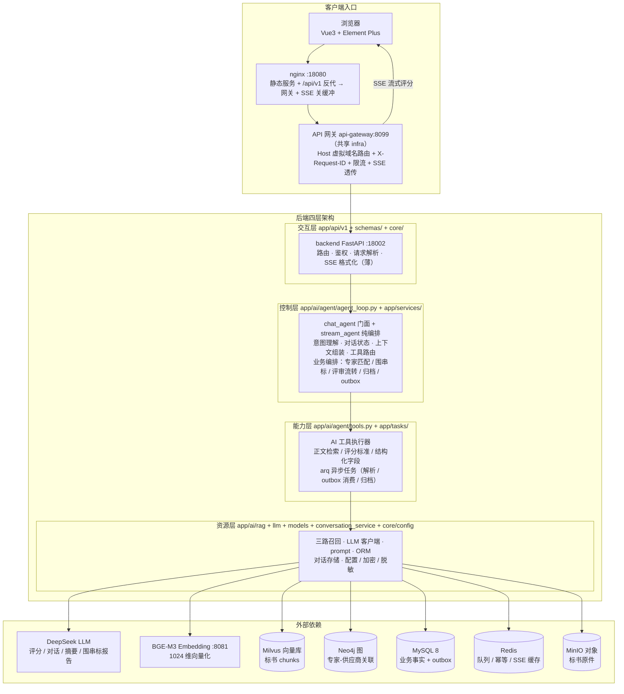

# AI 智能评标系统（smart-procurement）

> **一站式 AI 智能评标平台**：从投标受理、围串标风控、专家智能匹配与利益冲突回避，到 AI 辅助打分、评标汇总与定标归档，全链路数字化、可审计、可降级。

第一次接触这个项目，只看下面三句就够了：

- **做什么**：把招标评标从"人工翻阅数百页标书 + 十余维度逐一打分"变成"AI 逐维度预评分 + 专家确认修正"。投标、围串标检测、专家匹配与回避、AI 评审、汇总定标、归档留痕全流程在一个系统里闭环。
- **怎么做**：RAG 检索 + DeepSeek 大模型逐维度**流式辅助评分**（SSE 标准契约，附检索证据原文）；Neo4j 知识图谱推理 4 类利益冲突；文本语义 + 关系图谱 + 报价集中度三路围串标检测；outbox 事件保证 MySQL → Neo4j 最终一致。整个后端按**「交互层 → 控制层 → 能力层 → 资源层」四层单向依赖**组织。
- **好在哪**：评审周期从周级降到天级、冲突关系 100% 召回、围串标高风险一票否决、全链路留痕可审计；AI 故障按级降级不阻塞评审；335 项单元测试 + 118 项集成测试 + 6 条浏览器级 E2E 全绿，CI 三层门禁守护。

## 目录

- [一、这是什么](#一这是什么)
- [二、系统架构](#二系统架构)
- [三、快速开始](#三快速开始)
- [四、使用场景与示例](#四使用场景与示例)
- [五、技术闪光点](#五技术闪光点)
- [六、技术栈一览](#六技术栈一览)
- [七、配置说明](#七配置说明)
- [八、目录结构](#八目录结构)
- [九、测试与验收](#九测试与验收)
- [十、开发指南](#十开发指南)
- [十一、常见问题](#十一常见问题)
- [十二、已知限制与优化方向](#十二已知限制与优化方向)

---

## 一、这是什么

招标评标是**高合规要求、高人工成本、高风险**的业务，常见的坑有四个：

- **评审效率低**：专家对每份标书逐维度人工翻阅打分，数百页标书 + 十余维度，评审周期以周计；
- **利益冲突难查**：专家与投标商之间的任职、持股、同组织等关联靠人工记忆 / Excel 排查，漏查即构成违规风险；
- **围标串标隐蔽**：同一实控人多份标书、报价高度一致、文本雷同，靠肉眼难以识别；
- **过程难追溯**：评分依据、回避申报、检测结论散落各处，审计取证困难。

本系统针对以上四个痛点，提供四个核心能力：

| 能力 | 实现 | 对应痛点 |
|------|------|---------|
| **AI 辅助评审** | RAG 检索 + DeepSeek 大模型逐维度流式打分，专家确认 / 修正 | 评审效率 |
| **利益冲突回避** | Neo4j 知识图谱推理 4 类回避关系，申报 → 冲突 → 自动补匹配 | 合规风险 |
| **围串标检测** | 文本语义 + 关系图谱 + 报价集中度三路综合评分 | 围串标 |
| **全链路留痕** | outbox 事件、SSE 流式过程、报告 PDF、操作日志 | 可审计 |

> **一句话理解 RAG**：RAG（Retrieval-Augmented Generation，检索增强生成）= 先从标书里检索出与评分维度最相关的片段，再让大模型基于这些片段打分。这样大模型能针对"它的训练数据里根本没有"的每家投标人内容给出**有出处、可溯源**的评分建议，专家确认依据的是标书原文而非黑盒结论。

---

## 二、系统架构



> 箭头即**调用方向**：客户端请求经 nginx → 网关 → 交互层，**单向逐层下钻**（交互 → 控制 → 能力 → 资源，控制层不直连资源层、经能力层编排），结果自下而上经 SSE 返回；DeepSeek / BGE-M3 / Milvus / Neo4j / MySQL / Redis / MinIO 等外部依赖仅由资源层访问。

**对外链路（统一 API 网关）**：浏览器只访问前端 nginx；nginx 将 `/api/v1` 反代到共享网关 `api-gateway:8099`（`Host: sp.local`），网关按 Host 虚拟域名路由到本系统后端，并生成 `X-Request-ID`（后端日志 `trace_id` 即此值）、按真实 IP 限流、SSE 透传。网关由共享 infra 仓库提供（`infra/api-gateway/`），未知 Host 一律 403 防串线。宿主端口映射的 backend 地址（如 `localhost:18002`）仅供开发调试 / 契约直连，绕过网关。

**部署形态**：后端含 **app**（FastAPI :18002）+ **worker**（arq）两个容器——worker 执行能力层 `app/tasks/` 的异步任务（outbox 消费 / 标书解析 / 归档 / 僵尸扫描），SSE 由 app 直出、worker 不参与对外链路。

### 后端代码分层：四层单向依赖

上图一张图同时表达**对外链路**（客户端 → 网关 → 后端）与**后端四层代码分层**；代码组织按"是否有业务语义"切四层——让控制层只编排不干活，能力层承载工具操作，资源层向外部依赖抽象。依赖单向、边界可测。

**各层职责与模块归属：**

| 层 | 模块 | 职责 |
|----|------|------|
| 交互层 | `app/api/v1/` + `app/api/contracts.py` + `app/schemas/` + `app/core/` | 对外契约薄壳：路由、鉴权、请求解析、SSE 格式化、安全中间件。不承载业务编排；AI 链路只传「已鉴权评审 + 问题」收事件流 |
| 控制层 | `app/ai/agent/agent_loop.py` + `app/services/`（业务编排） | AI 编排：`chat_agent`（控制层门面，接管对话状态）+ `stream_agent`（纯编排），意图理解（intent.py）/ 对话状态 / 上下文组装 / 工具路由；业务编排：专家匹配、围串标判定、评审流转、归档、outbox 调度 |
| 能力层 | `app/ai/agent/tools.py` + `app/tasks/` | 操作执行：AI 工具执行器（`retrieve_knowledge` 标书正文检索 / `get_dimension_rubric` 评分标准 / `get_bid_structured_info` 结构化字段）+ arq 异步任务（标书解析 / outbox 消费 / 归档 / 僵尸扫描） |
| 资源层 | `app/ai/rag/` + `app/ai/llm/` + `app/models/` + `app/services/conversation_service.py` + `app/core/config.py` | 无业务语义的基础设施：三路召回、DeepSeek 客户端、prompt 模板、PII 清洗、ORM、对话存储、配置 / 加密 / 脱敏 |

分层结构与调用方向见上图。三条依赖规则：**单向**（交互 → 控制 → 能力 → 资源，上层可依赖下层、下层绝不反向依赖——控制层不直连资源层，数据访问一律经能力层编排下沉到资源层 ORM / 存储服务）；**依赖抽象不依赖实现**（控制层只调能力层的公开接口编排，`chat_agent` 面向 `stream_agent` 事件流与 `tools` 契约编排，不感知内部实现）；**数据流单向**（请求自交互层逐层下钻，结果自下而上经 SSE 返回）。

依赖方向被测试守护：`tests/unit/test_chat_agent.py` 固定门面语义——交互层只传「评审 + 问题」、`chat_agent` 内部完成加载历史 → 落库 user → 组装上下文 → 编排 → 落库 assistant（纯答案，思考剥离）的全过程，资源层三方法（`add_message` / `get_context` / `maybe_summarize`）全部 mock 隔离。交互层误触碰资源层、或状态管理回退到交互层，单测立即失败。

> `services/` 下模块按职责归层：承载业务编排的（review / expert_match / fraud_detection / outbox 等）归控制层；纯存储 / 基础设施的（conversation_service）归资源层——如同 `ai/agent/` 下同时存在控制层（agent_loop.py）与能力层（tools.py），同目录跨层由"是否有业务语义"界定。

**收敛状态（如实）**：上图为**依赖规则（目标架构）**。当前控制层 `agent_loop` 仍直连资源层 `app.ai.llm` / `app.models` / `app.services.conversation_service`，交互层 `api/v1` 仍直连 `services`（控制层）与 `app.core` / `app.models`（资源层，reviews 端点还直连 `app.ai.llm`）——这些越层调用正随重构逐项下沉到能力层，收敛后依赖严格为 交互→控制→能力→资源 单向、控制层不直连资源层。

### 编排模式：LLM 自主决策 + 规则护栏

对话式评审**不是**"先检索、后作答"的固定流程，而是让 LLM 自主决定"要不要查、查什么"，再由规则在关键口子上兜底：

1. **LLM 自主决策（chat 端点）**：第一轮带 3 个工具，由 LLM 判断问题该走哪条路——问标书正文 → `retrieve_knowledge`；问评分标准 → `get_dimension_rubric`；问报价 / 工期 / 团队等结构化数据 → `get_bid_structured_info`；闲聊 / 非文档问题 → 不调工具直接答（不浪费检索）。
2. **规则否决权（F3）**：LLM 决定"不查"，但规则判定该问题属于标书事实类（`rule_intent ∈ {query, unknown}`）→ **规则强制检索**，拦住"该查不查导致编造"。纯计算 / 常识类问题豁免（不否决、不误提示）。
3. **空结果规则兜底**：检索为空时按意图走固定话术——事实类 → 如实回答"根据当前标书内容，未找到与您问题直接相关的信息"（**不调用 LLM**，从源头杜绝空 context 编造）；意图不明 → 引导澄清；问候 / 非文档问题 → 交 LLM 自然作答。

一句话概括：**LLM 负责"怎么答"，规则负责"必须查的别漏查、查不到的别编造"。**

**评分端点（score）明确不做 agent 化**：自动评分必须检索证据 + 报价走确定性公式（综合评分法，可审计），无决策空间 → 保持硬编码链路，不引入 LLM 自主决策，保证打分可复现、可审计。

### 一次对话式评审的完整链路

以下按"LLM 决定检索"的路径描述；LLM 决定不检索时跳过 ⑥-⑦ 直接作答，F3 规则否决发生时强制进入 ⑥：

```
专家提问（已鉴权评审 + 问题）
  → ① 交互层 reviews.py    认证/鉴权/解析，调 chat_agent，消费事件流（目标架构：不触碰资源层）
  → ② 控制层 chat_agent    加载 bid/dimension → 回指最近 3 轮历史 → 落库 user 消息
  → ③ 控制层 get_context   组装上下文（对话历史 + 摘要 + 本次检索证据）
  → ④ LLM 第一轮自主决策   带 3 个工具判断是否需要查库（不查 → 直接作答）
  → ⑤ F3 规则否决          该查不查 → 强制检索，拦住编造
  → ⑥ 能力层 tools.py      执行工具（标书正文三路召回 / 评分标准 / 结构化字段）
  → ⑦ 资源层三路召回       向量 + 关键词 + 结构化，RRF 融合取 Top-8 证据
  → ⑧ LLM 第二轮作答       不带 tools，ThinkingAnswerSplitter 切分 reasoning/answer 增量
  → ⑨ SSE 事件序           meta → tool_call → reasoning/answer/thought → usage → done
  → ⑩ 控制层收尾           落库 assistant（纯答案，思考剥离）+ maybe_summarize
```

---

## 三、快速开始

> ⚠️ **前置依赖：共享 infra**。本系统**不自带任何中间件**（MySQL/Neo4j/Milvus/MinIO/Redis/BGE-M3 全在共享 infra），运行前须先部署共享 infra 仓库：
>
> ```bash
> # 发布物：clone infra 独立仓库后启动
> git clone https://github.com/zhanggy1984/share-infra && cd infra && docker compose up -d
> # 本地开发：infra 位于 ../infra
> cd ../infra && docker compose up -d
> ```

前置：Docker Desktop（Linux 容器）、Python 3.11 + Poetry。

### 第 1 步：配置环境变量

```bash
cp .env.example .env
# 编辑 .env，至少填写：
#   DEEPSEEK_API_KEY=sk-xxx        # DeepSeek API Key（AI 评分/对话必需）
#   JWT_SECRET_KEY=xxx             # JWT 签名密钥（openssl rand -hex 32 生成，缺失/弱值启动即拒绝）
#   FERNET_KEY=xxx                 # 身份证加密密钥（生产 openssl rand -base64 32；开发/演示可填 auto）
```

### 第 2 步：启动应用容器（app + worker + nginx）

```bash
docker compose up -d --build
# 首次含镜像构建
docker compose ps                 # sp-app / sp-worker / sp-web 全部 Up + healthy
curl localhost:18002/health/ready # {"status":"ok","mysql":"ok","neo4j":"ok",...}
```

> **端口说明**：`SP_APP_PORT` API 默认 **18002**、`WEB_PORT` 前端默认 **18080**（`.env` 可覆盖）。
> 本系统只起应用容器；MySQL/Neo4j/Milvus/MinIO/Redis/BGE-M3 全在共享 infra（库 `smart_procurement`、collection `sp_bid_documents`、bucket `bid-files`）。

### 第 3 步：初始化数据

> 示例数据已随全量迁移进入共享 infra（MySQL 22 表 + Neo4j 图谱 + Milvus `sp_bid_documents` + MinIO `bid-files`），通常无需初始化。
> 如需重建：`./scripts/setup_demo.sh`（建表 alembic → 合成数据 → 向量化，约 20 分钟；连接共享 infra）。

**跑起来了**：

```bash
./scripts/demo.sh                 # 命令行看 3 个业务场景
open http://localhost:18080      # 浏览器前端（演示账号见下）
```

| 角色 | 账号 | 密码 | 可做什么 |
|------|------|------|---------|
| 管理员 | `admin` | `123456` | 用户/项目/标段管理、围串标待办 |
| 项目经理 | `pm1` | `123456` | 专家匹配、评审进度、评标汇总、定标 |
| 评审专家 | `expert_01` | `123456` | 任务、回避申报、评审工作台、历史 |
| 供应商 | `supplier_01` | `123456` | 招标市场、投标上传、结果查询 |

---

## 四、使用场景与示例

### 4.1 给谁带来什么

**对招标方**
- **评审提效**：AI 对每维度预评分并给出引用依据，专家从"逐字翻阅"变为"确认 + 修正"，单标段评审周期从周级降到天级；
- **风控前置**：围串标在投标关闭即检测，HIGH/CRITICAL 高风险直接建议废标，阻止问题标书流入评审；
- **合规闭环**：回避申报强制走系统流程，冲突专家自动剔除并补充，全流程留痕可审计；
- **数据决策**：评标汇总归一化排名、分维度得分矩阵，定标依据一目了然。

**对评审专家**
- **AI 不替代人**：AI 打分只是辅助建议，附检索证据原文与来源，专家可手动调整，最终裁决权在人；
- **流式体验**：SSE 流式推送"检索 → 证据 → 思考 → 分数"全过程，专家实时看到 AI 的推理依据而非黑盒结论；
- **降级保障**：AI 服务熔断/超时自动切纯人工模式，专家评审永不被 AI 故障阻塞。

**对投标供应商**
- **在线投标**：标书上传即解析、即存证（MinIO 对象存储 + 哈希）；
- **结果透明**：定标后实时可见排名、分维度得分与落标原因，质疑有据可依；
- **黑名单管理**：违规供应商拉黑后级联废标并通知关联项目负责人。

### 4.2 一键造数

> 示例数据**客观可复现**：`setup_demo.sh` 用确定性 seed 合成 3 个完整业务场景（MySQL 22 表 + Neo4j 图谱 + Milvus 向量 + MinIO 标书原件），一键推进到各场景的"可观看点"状态。

```bash
docker compose up -d              # 应用容器就绪（app/worker/nginx；中间件走共享 infra）
./scripts/setup_demo.sh           # 建表 → 合成数据 → 向量化 → 推进 3 场景（约 20 分钟）
./scripts/demo.sh                 # 命令行走查 3 个场景
open http://localhost:18080      # 浏览器前端（演示账号见第三章快速开始）
```

幂等可重跑：重复执行会 TRUNCATE 重建（MySQL）+ MERGE 幂等（Neo4j）+ 先删后插（Milvus），结果一致。

### 4.3 3 个业务场景

`setup_demo.sh` 已用**客观数据驱动**推进好 3 个场景：

**场景 1 · 正常评审（LOT-008 数据治理标段 → EVALUATED）**
4 家无关联投标 → 围串标初筛 LOW 自动通过 → 匹配 2 位专家 → 回避申报无冲突 → 评审：报价维度走**纯公式**（综合评分法，可审计）、技术维度走 **DeepSeek 真实评分**（RAG 检索证据 + 流式打分）→ 结束评审出报告 PDF → 定标。**观看点**：`GET /lots/LOT-008/summary` 的归一化排名与分维度得分矩阵。

**场景 2 · 冲突回避（LOT-009 平台基础设施标段 → UNDER_REVIEW）**
专家 EXP-005 与投标商 SUP-010 存在持股关系（Neo4j `HOLDS_SHARE`）→ 匹配阶段被自动排除 → 其余专家申报无冲突进入评审。**观看点**：`GET /lots/LOT-009/reviews` 的专家 × 维度评审矩阵（冲突已剔除、补匹配已入列）。

**场景 3 · 围串标检测（LOT-007 移动应用标段 → PRE_SCREEN）**
SUP-012/013 同一实控人（`SAME_CONTROLLER`）且标书文本高相似（FAISS 命中 ≥7 对）+ 报价集中 → 初筛 MEDIUM 触发 → 深度检测综合 **HIGH 59.2**（图谱一票否决）→ 留在 PM 风险待办，不放行评审。**观看点**：`GET /lots/LOT-007/bids` 的 3 家标书与风险状态。

### 4.4 评测场景（契约声明）

`GET /api/contracts`（无鉴权）声明本系统的 LLM 评测接口与场景清单，供评测平台接口自动发现：

| 接口 | 用途 | 契约 |
|------|------|------|
| `POST /api/v1/reviews/{review_id}/score` | 自动评分 | SSE 流式：meta → tool_call(knowledge_retrieval) → reasoning/answer/thought → score → usage → done |
| `POST /api/v1/reviews/{review_id}/chat` | 对话式评审追问 | SSE 流式：meta → tool_call → reasoning/answer/thought → usage → done |

场景清单：技术方案 / 报价 / 利益冲突 / 围串标。**验收示例**（对运行中的服务，容器内）：

```bash
docker cp scripts/verify_sp_e2e.py sp-app:/app/
docker exec sp-app python scripts/verify_sp_e2e.py    # SSE 标准契约容器内验证（19/19）
# Windows Git Bash 下 docker 路径会转义，需加 MSYS_NO_PATHCONV=1 前缀：
#   MSYS_NO_PATHCONV=1 docker exec sp-app python scripts/verify_sp_e2e.py
```

---

## 五、技术闪光点

### 1. 四层单向依赖的代码分层
整个后端按「交互层 → 控制层 → 能力层 → 资源层」四层单向依赖组织：交互层 `api/v1 + schemas + core` 只做路由/鉴权/解析/SSE 格式化（薄壳，不承载业务编排）；控制层 `agent_loop.py + services/` **只编排不干活**——`chat_agent` 接管 AI 对话全部状态（加载历史 → 落库 → 组装上下文 → 编排 → 落库），业务服务编排专家匹配/围串标/评审流转；能力层 `tools.py + tasks/` 承载工具与异步任务执行；资源层 `rag/llm/models/conversation` 向 LLM/向量库/ORM 抽象。依赖单向、边界被单测守护（`test_chat_agent.py` 固定门面语义）——新增功能放错层、交互层直连资源层，提交即被拦（详见[第二章](#二系统架构)）。

### 2. 多存储各司其职的分工架构
不是"一个大数据库"，而是五种存储按数据形态分工：

| 存储 | 承载 | 为什么 |
|------|------|--------|
| MySQL 8 | 业务事实（项目/标段/标书/评审/申报） | 事务强一致，权威数据源 |
| Neo4j 图 | 专家-供应商关联网络（任职/持股/同组织） | 多跳关系推理，回避检测的核心 |
| Milvus 向量 | 标书 chunk 语义向量 | 相似度检索（RAG）与文本雷同检测 |
| MinIO 对象 | 标书 PDF/DOCX 原件 | 大文件存储 + 预签名下载 |
| Redis | arq 任务队列 / 评分幂等 / SSE 断流续推 | 异步流水线 + 高吞吐缓存 |

### 3. outbox 事务发件箱：MySQL → Neo4j 最终一致
业务写库与"待同步事件"**同库同事务**写入 outbox 表，绝不丢失；arq worker 用 `SELECT ... FOR UPDATE SKIP LOCKED` 拉取事件，从 MySQL 重建完整聚合再 MERGE 到 Neo4j，**幂等可重放**，失败自动重试 + 定时对账。这避免了双写不一致这一分布式系统最经典的坑。

### 4. RAG 三路召回 + RRF 融合的标书检索
评分时不是把整本标书塞给大模型，而是：
- **路1 向量召回**：BGE-M3 把 query 与标书 chunk 语义匹配（Milvus，IP 检索）；
- **路2 关键词召回**：从评分标准（dimension/criterion）与 query 提取术语做全量计数；
- **路3 结构化召回**：报价/工期/团队等结构化字段精确匹配；
- **RRF 融合**：三路结果倒数排名融合，取 Top-8 作为评分证据。

**维度感知注入**：检索时传入评分维度，把该维度的评分标准术语注入关键词路，让召回"跟着评分标准走"。基准验证：**Recall@5=1.000、MRR=1.000、拒答 100%、维度感知提升 +11%**。

### 5. SSE 标准契约流式 + 断流续推
评审/对话 SSE 事件流统一为标准契约：`meta → thinking → source(RAG 证据) → tool_call(knowledge_retrieval) → reasoning/answer/thought 增量 → score → usage → done`，全事件 data 内置 `ts`（unix ms）时间戳，`done` 显式携带结构化 `score`（评测端不依赖正则提取）。专家看到的是"AI 依据哪段标书原文打了多少分"，而非一句"25 分"。断网重连通过 `Last-Event-ID` 从 Redis 缓存续推已发帧。实测：**首 token 0.6s、完整流 5.6s**。契约由 `verify_sp_e2e.py` 在真实容器内断言（19/19）。

### 6. 断路器 + 三级降级矩阵
AI 不可用时系统不是报错，而是按级优雅降级：
- **LLM 熔断**（连续 5 次 5xx/超时）→ 评分流 503，前端红色 Banner 切换**纯人工评审模式**，AI 恢复后可一键切回；
- **向量检索超时** → 降级走关键词 + 结构化路（语义降级）；
- **无检索证据** → 明确输出"未找到相关依据"拒答文案，**绝不编造**。

### 7. 围串标深度检测：一票否决的高风险红线
投标关闭时三路综合评分（文本×0.4 + 图谱×0.35 + 报价×0.25）→ 四级风险：
- **文本语义**：FAISS 批量计算跨标书 chunk 相似对，命中对数 ≥7 判雷同；
- **关系图谱**：`SAME_CONTROLLER`（同一实控人）是**一票否决**红线——只要存在直接判 HIGH，防止被加权稀释；
- **报价集中度**：价差 <1% 视为异常集中。

LOT-007 示例场景：SUP-012/013 同一实控人 → 综合 **HIGH 59.2** → PM 风险待办。

### 8. 幂等异步解析流水线
标书上传后异步解析（提取结构化字段 → 智能分块 → BGE-M3 向量化 → Milvus 先删后插 → Neo4j 建节点），7 步 checkpoint 状态机 + 首次失败重试 3 次 + 僵尸任务扫描（PARSING 超 30min 自动置失败），全程可重跑、不残留脏数据。分块器**标题感知**（中文数字章节），保证 chunk 与章节语义对齐。

### 9. 安全与合规基线
- **数据加密**：专家身份证等敏感字段 Fernet 加密存储，统一 `redact()` 脱敏入口；LLM 输入侧另挂 PII 清洗层（检索后 / prompt 前脱敏身份证/手机/邮箱）；
- **密钥 fail-loud**：JWT / FERNET 密钥缺失、弱默认值、过短 → 启动即拒绝（`JWT_SECRET_KEY` 启动校验 + compose 强校验 + 清弱默认值；FERNET 防随机 key 重启后历史加密数据不可解密，开发/演示显式 `auto` 豁免）；
- **登录安全加固**：按真实 IP 限流 + access/refresh 双令牌（refresh 轮换、复用即吊销）+ 首登强制改密 + bcrypt cost=10；
- **权限模型**：ADMIN / PM / REVIEW_EXPERT / SUPPLIER 四角色 + 越权重定向（如评审任务归属校验、专家-标段指派校验）；
- **可观测**：structlog 结构化日志 + `X-Request-ID` 全链路透传。

### 10. 工程化质量
- **CI 三层门禁**（2026-08-28 落地）：L0 lint（ruff F-only，scope=app+tests+scripts）+ L0 build（前端 npm build）+ L1 unit（`pytest tests/unit -m "not external"`，离线全绿，CI 无 secrets）；
- **测试**：单元 335 项 / 集成 118 项 / 浏览器 E2E 6 条全绿；
- **质量基准**：RAG / AI 评分 / 意图识别三大基准全达标（真实 DeepSeek）；
- **SLA 压测**：核心链路 **8/8 达标**（标书解析 P50 52s、AI 完整流 5.6s、登录 0.06s、围串标检测 0.05s…）。

---

## 六、技术栈一览

| 层 | 技术 | 说明 |
|----|------|------|
| 后端 | Python 3.11 + FastAPI | async/await，OpenAPI 自动文档，SSE 流式原生支持 |
| ORM/迁移 | SQLAlchemy 2 (async) + Alembic | 异步 ORM，22 张表 |
| 前端 | Vue3 + Vite + Element Plus + Pinia | 4 角色工作台，SSE 流式消费 |
| 关系数据库 | MySQL 8 | 业务权威数据 + outbox 事件表 |
| 图数据库 | Neo4j 5 | 冲突网络推理（4 类回避关系） |
| 向量库 | Milvus 2.4 + BGE-M3 | 1024 维语义检索 / 文本雷同检测 |
| 对象存储 | MinIO | 标书原件 + 预签名下载 |
| 缓存/队列 | Redis + arq | 任务队列 / 幂等去重 / SSE 续推 |
| LLM | DeepSeek（openai 兼容） | 评分 / 对话 / 摘要 / 围串标报告 |
| 测试 | pytest + pytest-asyncio + Playwright | 单元 / 集成 / 浏览器 E2E |

---

## 七、配置说明

全量配置如下（`app/core/config.py` 为唯一权威来源，`.env.example` 每项含注释；只覆盖要改的项即可，其余用默认值）：

| 配置 | 说明 | 默认值 |
|------|------|--------|
| **运行模式** | | |
| `DATASOURCE_MODE` | 数据源模式：`synthetic` 合成数据 / `real` 真实接入 | `synthetic` |
| `DEBUG` | FastAPI 调试模式 | `false` |
| `LOG_LEVEL` | 日志级别 | `INFO` |
| **MySQL** | | |
| `MYSQL_HOST` / `MYSQL_PORT` | 连接地址 / 端口 | `localhost` / `3306` |
| `MYSQL_DATABASE` / `MYSQL_USER` / `MYSQL_PASSWORD` | 库名 / 账号 / 密码 | `smart_procurement` / `smart` / `smart_procurement_dev` |
| `MYSQL_ROOT_PASSWORD` | 容器初始化 root 密码 | `root_dev_pass` |
| `MYSQL_URL` | SQLAlchemy async 连接串（显式配置时优先于分项） | 分项自动拼接 |
| `MYSQL_CONNECT_TIMEOUT` / `MYSQL_READ_TIMEOUT` | 连接 / 读取超时（秒） | `5.0` / `60.0` |
| **Neo4j** | | |
| `NEO4J_URI` / `NEO4J_USER` / `NEO4J_PASSWORD` | 图数据库连接 | `bolt://localhost:7687` / `neo4j` / `neo4j_dev_pass` |
| **Milvus** | | |
| `MILVUS_HOST` / `MILVUS_PORT` | 向量库连接地址 / 端口 | `localhost` / `19530` |
| `MILVUS_COLLECTION` | 向量集合名 | `bid_documents` |
| **MinIO** | | |
| `MINIO_ENDPOINT` / `MINIO_BUCKET` | 对象存储端点 / 桶 | `localhost:9000` / `bid-files` |
| `MINIO_ACCESS_KEY` / `MINIO_SECRET_KEY` | 访问凭证 | `minioadmin` / `minio_dev_pass` |
| `MINIO_PRESIGN_EXPIRY_SECONDS` | 预签名下载链接有效期（秒） | `1800` |
| `MINIO_CONNECT_TIMEOUT` / `MINIO_READ_TIMEOUT` | 连接 / 读取超时（秒） | `5.0` / `60.0` |
| **Redis** | | |
| `REDIS_URL` | Redis 连接串（compose 内自动指向 `redis://redis:6379/0`） | `redis://localhost:6379/0` |
| **AI 服务** | | |
| `DEEPSEEK_API_KEY` | DeepSeek API Key（**必填**，缺失/非法则 `/health/ready` 的 deepseek 为 fail） | `sk-xxx` |
| `DEEPSEEK_BASE_URL` / `DEEPSEEK_MODEL` | LLM 服务地址 / 模型名 | `https://api.deepseek.com/v1` / `deepseek-chat` |
| `DEEPSEEK_ENABLED` | AI 总开关（false → 断路器直接 OPEN，评审降级纯人工模式） | `true` |
| `AGENT_RULE_OVERRIDE_ENABLED` | F3 规则否决权开关（false → 完全信任 LLM 工具决策） | `true` |
| `DEEPSEEK_TIMEOUT` / `DEEPSEEK_MAX_RETRIES` | 单次调用超时（秒）/ 最大重试次数 | `60.0` / `3` |
| `DEEPSEEK_CIRCUIT_BREAKER_THRESHOLD` | 连续 N 次 5xx/超时后熔断（OPEN 30s） | `5` |
| `BGE_M3_ENDPOINT` | BGE-M3 向量化服务端点（compose 内自动指向 `http://bge-m3:8081`） | 空（dev 直连） |
| `BGE_M3_MODEL` | 向量模型名 | `BAAI/bge-m3` |
| **文档解析 / RAG** | | |
| `DOC_CHUNK_MIN_TOKENS` / `DOC_CHUNK_MAX_TOKENS` | 分块最小 / 最大 token | `500` / `1000` |
| `DOC_CHUNK_OVERLAP_TOKENS` | 相邻分块重叠 token | `100` |
| `DOC_ZOMBIE_TIMEOUT_MINUTES` | 解析任务僵尸判定（分钟） | `30` |
| `DOC_PARSE_MAX_RETRIES` / `DOC_PARSE_RETRY_DELAY_SECONDS` | 解析失败重试次数 / 重试间隔（秒） | `3` / `60` |
| **安全** | | |
| `JWT_SECRET_KEY` | JWT 签名密钥（**必填**，≥32 随机字符；缺失/弱值启动即拒绝 fail-loud） | 无默认 |
| `JWT_ACCESS_TOKEN_EXPIRE_MINUTES` / `JWT_REFRESH_TOKEN_EXPIRE_DAYS` | access / refresh 令牌有效期 | `30` 分钟 / `7` 天 |
| `FERNET_KEY` | 身份证加密密钥（**生产必填**，缺失/非法启动即拒绝；开发/演示显式 `auto` 豁免） | 无默认 |
| `LOGIN_RATE_LIMIT` / `LOGIN_RATE_WINDOW_SECONDS` / `LOGIN_COOLDOWN_SECONDS` | 登录限流：窗口内最大尝试 / 窗口（秒）/ 失败冷却（秒） | `5` / `60` / `900` |
| **业务参数** | | |
| `CONFLICT_EMPLOYMENT_YEARS` | 任职冲突追溯年限 | `3` |
| `REVIEW_DEVIATION_THRESHOLD` | 评审偏差预警阈值 | `0.15` |
| `FRAUD_AUTO_PASS_THRESHOLD` / `FRAUD_CRITICAL_THRESHOLD` | 围串标初筛自动通过 / 深度检测 CRITICAL 阈值 | `25` / `75` |
| **宿主端口**（compose 模板变量） | | |
| `SP_APP_PORT` / `WEB_PORT` | API / 前端宿主端口映射（容器内固定 8000/80；同机多栈冲突改这里） | `18002` / `18080` |
| `REDIS_PORT` / `BGE_M3_PORT` | Redis / BGE-M3 宿主端口（与共享 infra 冲突时调整，须同步 `REDIS_URL` / `BGE_M3_ENDPOINT`） | `6379` / `8081` |

---

## 八、目录结构

```
smart-procurement/
├── app/                        # 后端源码（FastAPI）
│   ├── main.py                 # 应用入口 + 生命周期（中间件健康检查）
│   ├── api/
│   │   ├── contracts.py        # GET /api/contracts 契约清单（评测平台发现）
│   │   └── v1/                 # 交互层：REST 路由（auth/projects/bids/matching/reviews/...）
│   │                           #   认证/鉴权/解析/SSE 格式化（薄），AI 链路只传「评审+问题」收事件流
│   ├── services/               # 业务服务层（专家匹配/围串标/评审/outbox/归档/对话...）
│   │                           #   conversation_service = AI 链路的资源层（消息/上下文/摘要）
│   ├── ai/
│   │   ├── agent/              # AI 链路控制层 + 能力层
│   │   │   ├── agent_loop.py   #   控制层：chat_agent 门面 + stream_agent 纯编排
│   │   │   ├── tools.py        #   能力层：工具执行器（正文检索/评分标准/结构化字段）
│   │   │   └── intent.py       #   意图理解（query/unknown/smalltalk...）
│   │   ├── rag/                # 资源层：分块器 / 向量化 / 三路召回检索 / 降级判定
│   │   └── llm/                # 资源层：DeepSeek 客户端(断路器) / prompt 模板 / PII 清洗
│   ├── core/                   # 配置 / 安全(bcrypt+JWT) / 加密脱敏 / 中间件
│   ├── models/                 # 资源层：SQLAlchemy 模型（22 表）
│   ├── schemas/                # Pydantic 请求/响应
│   └── tasks/                  # arq 异步任务（解析/outbox/归档/僵尸扫描）
├── web/                        # 前端（Vue3 + Vite + Element Plus）
│   ├── src/views/              # 4 角色 20+ 页面
│   └── src/api/                # axios 接口模块
├── docker/
│   ├── bge-m3/                 # BGE-M3 向量服务镜像
│   ├── nginx/                  # 前端反代 + SSE 配置
│   └── milvus/                 # Milvus 完整配置
├── scripts/                    # 数据生成/导入/验收/验证脚本
│   ├── generate_synthetic_data.py    # 合成数据生成（确定性 seed）
│   ├── import_synthetic_mysql.py     # MySQL 导入（TRUNCATE 重建）
│   ├── import_synthetic_neo4j.py     # Neo4j 导入（MERGE 幂等）
│   ├── enrich_synthetic_bids.py      # 标书正文强化 + Milvus 向量化
│   ├── advance_p7_scenarios.py       # 3 业务场景推进
│   ├── setup_demo.sh                 # 一键初始化
│   ├── demo.sh                       # 3 场景演示
│   ├── accept_p*.py                  # 各阶段 API 验收脚本
│   ├── verify_sp_e2e.py              # SSE 标准契约容器内验证（19/19）
│   └── benchmark_p75/                # RAG/AI 评分/意图质量基准
├── tests/                      # 单元(unit 335) + 集成(integration 118) + E2E(6)
├── alembic/                    # 数据库迁移
├── .github/workflows/ci.yml    # CI 三层门禁（L0 lint + L0 build + L1 unit）
├── docker-compose.yml          # 应用容器编排（app/worker/nginx，中间件走共享 infra）
├── .env.example                # 环境变量模板（每项含注释）
├── solution.md                 # 技术方案（设计依据）
├── task.md                     # 任务拆分与验收标准
└── README.md
```

**后端代码分层**（整个后端按"是否有业务语义"切四层，依赖单向——下层绝不依赖上层；分层图与依赖规则详见[第二章](#二系统架构)）：
- **交互层** `app/api/v1/` + `app/api/contracts.py` + `app/schemas/` + `app/core/`：路由、鉴权、请求解析、SSE 格式化、安全中间件（薄）；
- **控制层** `app/ai/agent/agent_loop.py` + `app/services/`（业务编排）：AI 编排（意图/对话状态/上下文/工具路由）+ 业务编排（专家匹配/围串标/评审流转/归档/outbox）；
- **能力层** `app/ai/agent/tools.py` + `app/tasks/`：AI 工具执行器 + arq 异步任务执行；
- **资源层** `app/ai/rag/` + `app/ai/llm/` + `app/models/` + `app/services/conversation_service.py` + `app/core/config.py`：无业务语义的基础设施（LLM / 向量库 / ORM / 对话存储 / 配置加密）。

新增功能按职责归层：新增编排去 `agent/` 或 `services/`；新增工具去 `agent/tools.py`（注册进 `CHAT_TOOLS`）；新增任务去 `tasks/`；数据访问一律经 `models/` 或资源层服务。新增服务须归层并保持依赖方向（`test_chat_agent.py` 自动守护）。

---

## 九、测试与验收

| 层 | 内容 | 说明 |
|----|------|------|
| 单元测试 | `tests/unit/` **335 项** | 纯函数级，不依赖外部服务；含 `test_chat_agent.py`（四层门面语义）、`test_agent_loop.py`（编排）、`test_agent_tools.py`（能力层）、`test_retriever.py`（三路召回）、`test_deepseek_client.py`（断路器）、`test_conversation_service.py`（对话存储）等 |
| 集成测试 | `tests/integration/` **118 项** | 真实中间件（MySQL/Neo4j/Milvus/MinIO/Redis）+ mock LLM；API 成功/错误路径、跨存储一致性、降级链路、SSE 契约（含 chat/score 三发对齐、幂等 422、缓存重放） |
| 浏览器 E2E | `tests/e2e/` **6 条** | Playwright 真实容器（nginx:18080）：正常评审全链路至定标、冲突回避、围串标初筛、AI 降级切纯人工、黑名单级联废标、替补匹配 |
| 契约验证 | `scripts/verify_sp_e2e.py` | 容器内运行时读真实 SSE 事件流，断言 meta 首帧 / tool_call(knowledge_retrieval) / reasoning/answer/thought 三发对齐 / done 收尾 / usage 正 / answer 拼接 == done.content（19/19） |
| CI 门禁 | `.github/workflows/ci.yml` | 三层：L0 lint（ruff F-only，scope=app+tests+scripts）+ L0 build（前端 npm build）+ L1 unit（离线全绿）；PR 到 main + push main/dev 触发，无 secrets |
| 质量基准 | `scripts/benchmark_p75/` | RAG（Recall@5/MRR/拒答）/ AI 评分 / 意图识别三大基准（真实 DeepSeek） |
| SLA 压测 | `scripts/sla_p76.py` | 核心链路 8/8 达标（登录 0.06s、AI 完整流 5.6s、标书解析 P50 52s…） |

运行全部测试：

```bash
poetry run pytest tests/unit -p no:html -p no:metadata        # 单元（335，离线）
poetry run pytest tests/integration -p no:html -p no:metadata # 集成（118，需容器）
poetry run pytest tests/e2e -p no:html -p no:metadata -m e2e  # 浏览器 E2E（6，需容器+前端构建）
```

---

## 十、开发指南

### 环境
```bash
cd ../infra && docker compose up -d   # 起共享 infra（MySQL/Neo4j/Milvus/Redis/BGE-M3）
cd ../smart-procurement
poetry install                    # 依赖安装（含 playwright 浏览器需另 `playwright install`）
cp .env.example .env              # 配 DEEPSEEK_API_KEY / JWT_SECRET_KEY / FERNET_KEY
poetry run uvicorn app.main:app --reload --port 18002  # 本地热重载 API
```

### 改后端代码
- `app/` 以只读卷挂载进容器（`./app:/app/app:ro`），**改代码 `docker compose restart app worker` 即生效**，无需重建镜像；
- 改依赖（pyproject）才需 `docker compose build app`。

### 改 AI 链路（四层分层约束）
- **交互层**：只改 `api/v1/reviews.py` 的认证 / 解析 / SSE 格式化，不动对话状态；
- **控制层**：改 `agent/agent_loop.py` 的编排 / 上下文组装 / 路由，新增意图类型去 `intent.py`；
- **能力层**：新增工具去 `agent/tools.py`（注册进 `CHAT_TOOLS`），让控制层通过工具契约编排；
- **资源层**：改 `rag/` `llm/` `models/` `conversation_service.py`，向下兼容控制层的调用面；
- 保持依赖方向：交互层不触碰资源层、控制层不写直接 SQL。改完跑 `tests/unit/test_chat_agent.py` + `test_agent_loop.py` 守护门面语义。

### 跑测试 / 验收
- 各阶段验收脚本 `scripts/accept_p*.py`（`poetry run python scripts/accept_p51_api.py` 等），幂等可重跑；
- 提交前先跑 `pytest tests/unit`，确保不破坏既有 335 项。

### 新增 API
- models → schemas → services → api/v1 路由 → router 注册到 `main.py` → 验收脚本；
- **契约优先**：对外接口先出方案，评审确认后再实现（本项目架构约束）；LLM 相关接口如需评测平台发现，同步登记进 `api/contracts.py` 的清单。

### 数据库变更
- 改模型后 `poetry run alembic revision --autogenerate -m "描述"` → `poetry run alembic upgrade head`；
- 已部署环境重建示例数据用 `./scripts/setup_demo.sh`。

### 编码规范（约定）
- 4 空格缩进、阿里 Java 规范思想；注释写"为什么"；中文注释、英文标识符；
- 新增接口/消费者打印入参出参（debug 级）；核心逻辑（Service 业务分支）必须单测覆盖；
- **提交前**：本地过一遍 `ruff check app tests scripts --select F`（与 CI L0 对齐，防 CI 打回）。

---

## 十一、常见问题

| 现象 | 处理 |
|------|------|
| `/health/ready` 里 `deepseek` 为 fail | 检查 `.env` 的 `DEEPSEEK_API_KEY` 是否有效、`DEEPSEEK_ENABLED=true` |
| 启动报 JWT/FERNET 密钥校验失败 | `JWT_SECRET_KEY`（`openssl rand -hex 32`）/ `FERNET_KEY`（生产 `openssl rand -base64 32`；开发/演示可显式填 `auto`）未配置或为弱值 |
| `bge_m3` 为 fail | 首次启动需下载模型（hf-mirror），等 `sp-bge-m3` healthy；或确认 `BGE_M3_ENDPOINT` |
| 前端 18080 白屏 | `web/` 未构建 dist：`cd web && npm install && npm run build`，重启 nginx |
| AI 评分显示"纯人工模式" | DeepSeek 熔断或停用（`DEEPSEEK_ENABLED=false`），恢复后前端可一键切回 |
| 端口冲突（同机多栈） | 宿主端口已参数化：`SP_APP_PORT`(API 默认 18002) / `WEB_PORT`(前端默认 18080)，改 `.env` 对应变量即可；中间件端口由共享 infra 管理 |
| 示例数据被污染 | 重跑 `./scripts/setup_demo.sh`（TRUNCATE 重建，幂等） |
| 契约验证 chat 段偶发失败 | 共享 infra 连接层偶发压力（见第十二章已知限制），重启 `docker restart sp-app` 后等 45s 预热再跑；先查 `SHOW GLOBAL STATUS LIKE 'Aborted_connects'` 排除连接层，别误判业务改动 |
| 压测/基准脚本 | `poetry run python scripts/sla_p76.py` / `scripts/benchmark_p75/` 各基准，见文件头注释 |

---

## 十二、已知限制与优化方向

**如实说明当前已知的性能与边界问题：**

1. **共享中间件连接层偶发压力**：本系统连接共享 infra 的 MySQL / Redis，多栈共用同一实例，高峰期新连接偶发超时 / read timeout（连接池冷启动、端口转发链路波动）。**缓解**：重启后等 45s+ 热身再跑长回归；契约验证 chat 段偶发失败先判连接层，勿误归业务改动。根治方向：独立实例 / 连接池预热。
2. **评分端点不做 agent 化（决策空间取舍）**：score 端点必须检索证据 + 报价走确定性公式（可审计），无决策空间 → 硬编码链路。这是有意取舍（打分可复现优先于灵活编排），不是缺陷。
3. **LLM 为外部依赖**：评审 / 对话依赖 DeepSeek 网络可用性，熔断降级（三级降级矩阵）已兜底；大并发场景受外部限流约束。方向：接入备选模型 / 本地化推理。
4. **RAG 检索依赖向量库冷启动**：BGE-M3 模型首次加载需下载；Milvus collection 需 load 后检索。已做降级（语义路不可用自动走关键词 + 结构化）。

---

## 文档索引

- **技术方案**：[solution.md](solution.md)（架构设计、数据模型、API 契约、风险控制）
- **任务拆分与验收**：[task.md](task.md)（P0-P8 逐项任务与验收标准）
- **已实现 API 清单**：solution.md 4.6（35+ 端点 + SSE 事件流）；标准契约清单 `GET /api/contracts`（无鉴权）
