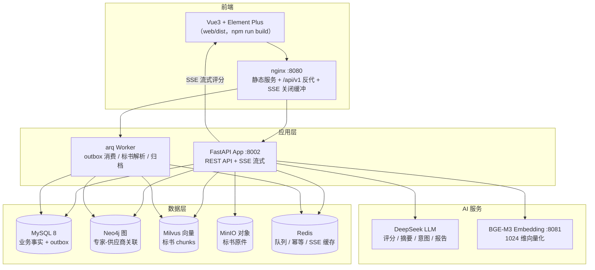

# AI 智能评标系统（smart-procurement）

> **一站式 AI 智能评标平台**：从投标受理、围串标风控、专家智能匹配与利益冲突回避，到 AI 辅助打分、评标汇总与定标归档，全链路数字化、可审计、可降级。

本系统是**生产级全栈演示项目**：9 个容器一键启动、3 大业务场景数据开箱即演示、164 项单元测试 + 89 项集成测试 + 6 条浏览器级 E2E 全绿、核心链路 SLA 压测 8/8 达标。

---

## 目录

- [一、项目简介：解决什么痛点](#一项目简介解决什么痛点)
- [二、业务价值：给谁带来什么](#二业务价值给谁带来什么)
- [三、技术闪光点](#三技术闪光点)
- [四、系统架构](#四系统架构)
- [五、技术栈一览](#五技术栈一览)
- [六、快速开始（3 步跑起来）](#六快速开始3-步跑起来)
- [七、3 大演示场景](#七3-大演示场景)
- [八、目录结构](#八目录结构)
- [九、测试与验收](#九测试与验收)
- [十、开发指南](#十开发指南)
- [十一、常见问题](#十一常见问题)

---

## 一、项目简介：解决什么痛点

招标评标是**高合规要求、高人工成本、高风险**的业务：

- **评审效率低**：专家对每份标书逐维度人工翻阅打分，数百页标书 + 十余维度，评审周期以周计；
- **利益冲突难查**：专家与投标商之间的任职、持股、同组织等关联靠人工记忆/Excel 排查，漏查即构成违规风险；
- **围标串标隐蔽**：同一实控人多份标书、报价高度一致、文本雷同，靠肉眼难以识别；
- **过程难追溯**：评分依据、回避申报、检测结论散落各处，审计取证困难。

本系统针对以上四个痛点，提供四个核心能力：

| 能力 | 实现 | 对应痛点 |
|------|------|---------|
| **AI 辅助评审** | RAG 检索 + DeepSeek 大模型逐维度打分，专家确认/修正 | 评审效率 |
| **利益冲突回避** | Neo4j 知识图谱推理 4 类回避关系，申报 → 冲突 → 自动补匹配 | 合规风险 |
| **围标串标检测** | 文本语义 + 关系图谱 + 报价集中度三路综合评分 | 围串标 |
| **全链路留痕** | outbox 事件、SSE 流式过程、报告 PDF、操作日志 | 可审计 |

---

## 二、业务价值：给谁带来什么

### 对招标方
- **评审提效**：AI 对每维度预评分并给出引用依据，专家从"逐字翻阅"变为"确认 + 修正"，单标段评审周期从周级降到天级；
- **风控前置**：围串标在投标关闭即检测，HIGH/CRITICAL 高风险直接建议废标，阻止问题标书流入评审；
- **合规闭环**：回避申报强制走系统流程，冲突专家自动剔除并补充，全流程留痕可审计；
- **数据决策**：评标汇总归一化排名、分维度得分矩阵，定标依据一目了然。

### 对评审专家
- **AI 不替代人**：AI 打分只是辅助建议，附检索证据原文与来源，专家可手动调整，最终裁决权在人；
- **流式体验**：SSE 流式推送"检索 → 证据 → 思考 → 分数"全过程，专家实时看到 AI 的推理依据而非黑盒结论；
- **降级保障**：AI 服务熔断/超时自动切纯人工模式，专家评审永不被 AI 故障阻塞。

### 对投标供应商
- **在线投标**：标书上传即解析、即存证（MinIO 对象存储 + 哈希）；
- **结果透明**：定标后实时可见排名、分维度得分与落标原因，质疑有据可依；
- **黑名单管理**：违规供应商拉黑后级联废标并通知关联项目负责人。

---

## 三、技术闪光点

### 1. 多存储各司其职的分工架构
不是"一个大数据库"，而是五种存储按数据形态分工：

| 存储 | 承载 | 为什么 |
|------|------|--------|
| MySQL 8 | 业务事实（项目/标段/标书/评审/申报） | 事务强一致，权威数据源 |
| Neo4j 图 | 专家-供应商关联网络（任职/持股/同组织） | 多跳关系推理，回避检测的核心 |
| Milvus 向量 | 标书 chunk 语义向量 | 相似度检索（RAG）与文本雷同检测 |
| MinIO 对象 | 标书 PDF/DOCX 原件 | 大文件存储 + 预签名下载 |
| Redis | arq 任务队列 / 评分幂等 / SSE 断流续推 | 异步流水线 + 高吞吐缓存 |

### 2. outbox 事务发件箱：MySQL → Neo4j 最终一致
业务写库与"待同步事件"**同库同事务**写入 outbox 表，绝不丢失；arq worker 用 `SELECT ... FOR UPDATE SKIP LOCKED` 拉取事件，从 MySQL 重建完整聚合再 MERGE 到 Neo4j，**幂等可重放**，失败自动重试 + 定时对账。这避免了双写不一致这一分布式系统最经典的坑。

### 3. RAG 三路召回 + RRF 融合的标书检索
评分时不是把整本标书塞给大模型，而是：
- **路1 向量召回**：BGE-M3 把 query 与标书 chunk 语义匹配（Milvus，IP 检索）；
- **路2 关键词召回**：从评分标准（dimension/criterion）与 query 提取术语做全量计数；
- **路3 结构化召回**：报价/工期/团队等结构化字段精确匹配；
- **RRF 融合**：三路结果倒数排名融合，取 Top-8 作为评分证据。

**维度感知注入**：检索时传入评分维度，把该维度的评分标准术语注入关键词路，让召回"跟着评分标准走"。P7.5 基准验证：**Recall@5=1.000、MRR=1.000、拒答 100%、维度感知提升 +11%**。

### 4. SSE 标准契约流式 AI 评分 + 断流续推
评审/对话 SSE 事件流统一为标准契约（评测 §5.1）：`meta → thinking → source(RAG 证据) → tool_call(knowledge_retrieval) → reasoning/answer/thought 增量 → score → usage → done`，全事件 data 内置 ts（unix ms）时间戳，`done` 显式携带结构化 `score`（评测端不依赖正则提取）。专家看到的是"AI 依据哪段标书原文打了多少分"，而非一句"25 分"。断网重连通过 `Last-Event-ID` 从 Redis 缓存续推已发帧。P7.6 实测：**首 token 0.6s、完整流 5.6s**。

另有公开的 **`GET /api/contracts`** 契约清单端点（无鉴权）：声明本 agent 的 LLM 评测接口（chat / score，均 SSE 流式）与场景清单（技术方案 / 报价 / 利益冲突 / 围串标），供评测平台接口自动发现。

### 5. 断路器 + 三级降级矩阵
AI 不可用时系统不是报错，而是按级优雅降级：
- **LLM 熔断**（连续 5 次 5xx/超时）→ 评分流 503，前端红色 Banner 切换**纯人工评审模式**，AI 恢复后可一键切回；
- **向量检索超时** → 降级走关键词 + 结构化路（语义降级）；
- **无检索证据** → 明确输出"未找到相关依据"拒答文案，**绝不编造**。

### 6. 围串标深度检测：一票否决的高风险红线
投标关闭时三路综合评分（文本×0.4 + 图谱×0.35 + 报价×0.25）→ 四级风险：
- **文本语义**：FAISS 批量计算跨标书 chunk 相似对，命中对数 ≥7 判雷同；
- **关系图谱**：`SAME_CONTROLLER`（同一实控人）是**一票否决**红线——只要存在直接判 HIGH，防止被加权稀释；
- **报价集中度**：价差 <1% 视为异常集中。

LOT-007 演示场景：SUP-012/013 同一实控人 → 综合 **HIGH 59.2** → PM 风险待办。

### 7. 幂等异步解析流水线
标书上传后异步解析（提取结构化字段 → 智能分块 → BGE-M3 向量化 → Milvus 先删后插 → Neo4j 建节点），7 步 checkpoint 状态机 + 首次失败重试 3 次 + 僵尸任务扫描（PARSING 超 30min 自动置失败），全程可重跑、不残留脏数据。分块器**标题感知**（中文数字章节），保证 chunk 与章节语义对齐。

### 8. 安全与合规基线
- **数据加密**：专家身份证等敏感字段 Fernet 加密存储，统一 `redact()` 脱敏入口；
- **密码安全**：bcrypt cost=10 + 复杂度校验 + JWT 双令牌（access 30min / refresh 7d）；
- **权限模型**：ADMIN / PM / REVIEW_EXPERT / SUPPLIER 四角色 + 越权重定向；
- **可观测**：structlog 结构化日志 + `X-Request-ID` 全链路透传。

### 9. 工程化质量
- **P7.2**：单元测试 164 项全绿，覆盖率 32% → **74%**；
- **P7.3**：集成测试 89 项全绿（20 个 API 成功/错误路径 + 5 项跨存储一致性 + 4 项降级）；
- **P7.4**：6 条 Playwright **浏览器级** E2E 全绿（真实容器 nginx:8080）；
- **P7.5**：RAG / AI 评分 / 意图识别三大质量基准全达标（真实 DeepSeek）；
- **P7.6**：核心链路 SLA 压测 **8/8 达标**（标书解析 P50 52s、AI 完整流 5.6s、登录 0.06s、围串标检测 0.05s…）。

---

## 四、系统架构



**关键链路**：投标上传 → 异步解析（worker：提取 → 分块 → 向量化入库）→ 投标关闭触发围串标检测 → 专家匹配（MySQL 候选 + Neo4j 冲突排除）→ 回避申报 → 评审（RAG 检索 → DeepSeek 流式评分 → 专家确认）→ 结束评审出报告 PDF → 定标归档 → 供应商查看结果。

---

## 五、技术栈一览

| 层 | 技术 | 说明 |
|----|------|------|
| 后端 | Python 3.11 + FastAPI | async/await，OpenAPI 自动文档 |
| ORM/迁移 | SQLAlchemy 2 (async) + Alembic | 异步 ORM，22 张表 |
| 前端 | Vue3 + Vite + Element Plus + Pinia | 4 角色工作台，SSE 流式消费 |
| 关系数据库 | MySQL 8 | 业务权威数据 + outbox 事件表 |
| 图数据库 | Neo4j 5 | 冲突网络推理（4 类回避关系） |
| 向量库 | Milvus 2.4 + BGE-M3 | 1024 维语义检索 / 文本雷同检测 |
| 对象存储 | MinIO | 标书原件 + 预签名下载 |
| 缓存/队列 | Redis + arq | 任务队列 / 幂等去重 / SSE 续推 |
| LLM | DeepSeek（openai 兼容） | 评分 / 摘要 / 意图 / 围串标报告 |
| 测试 | pytest + pytest-asyncio + Playwright | 单元 / 集成 / 浏览器 E2E |

---

## 六、快速开始（3 步跑起来）

> 前置：Docker Desktop（Linux 容器）、Python 3.11 + Poetry。

### 第 1 步：配置环境变量

```bash
cp .env.example .env
# 编辑 .env，至少填入：
#   DEEPSEEK_API_KEY=sk-xxx        # DeepSeek API Key（AI 评分/意图必需）
```

### 第 2 步：一键启动全栈（9 个容器）

```bash
docker compose up -d
# 等待各容器 healthy（首次含镜像构建与 BGE-M3 模型下载，约 5-15 分钟）
docker compose ps                 # 全部 Up + healthy
curl localhost:8002/health/ready  # {"status":"ok","mysql":"ok","neo4j":"ok",...}
```

> **端口说明**：宿主端口已参数化（`SP_APP_PORT` API 默认 **8002**、`WEB_PORT` 前端默认 **8080**、`MYSQL_PORT`/`MILVUS_PORT`/`REDIS_PORT`/`BGE_M3_PORT`）。同机跑多套栈端口冲突时，在 `.env` 覆盖对应变量即可；容器内部服务名互连不受影响。实际访问端口以 `.env` 为准。

### 第 3 步：初始化数据（建表 + 合成数据 + 演示场景）

```bash
poetry install                    # 宿主机环境（scripts/alembic 在宿主机跑）
./scripts/setup_demo.sh           # 建表→导入合成数据→52 份标书向量化→3 场景就绪（约 20 分钟，首次）
```

**跑起来了**：

```bash
./scripts/demo.sh                 # 命令行看 3 个业务场景
open http://localhost:8080        # 浏览器前端（演示账号见下）
```

| 角色 | 账号 | 密码 | 可做什么 |
|------|------|------|---------|
| 管理员 | `admin` | `Smart@2026` | 用户/项目/标段管理、围串标待办 |
| 项目经理 | `pm1` | `Smart@2026` | 专家匹配、评审进度、评标汇总、定标 |
| 评审专家 | `expert_01` | `Smart@2026` | 任务、回避申报、评审工作台、历史 |
| 供应商 | `supplier_01` | `Smart@2026` | 招标市场、投标上传、结果查询 |

---

## 七、3 大演示场景

`setup_demo.sh` 已用**客观数据驱动**推进好 3 个场景，`demo.sh` 可直接观看：

### 场景 1 · 正常评审（LOT-008 数据治理标段 → EVALUATED）
4 家无关联投标 → 围串标初筛 LOW 自动通过 → 匹配 2 位专家 → 回避申报无冲突 → 评审：报价维度走**纯公式**（综合评分法，可审计）、技术维度走 **DeepSeek 真实评分**（RAG 检索证据 + 流式打分）→ 结束评审出报告 PDF → 定标。**观看点**：`GET /lots/LOT-008/summary` 的归一化排名与分维度得分矩阵。

### 场景 2 · 冲突回避（LOT-009 平台基础设施标段 → UNDER_REVIEW）
专家 EXP-005 与投标商 SUP-010 存在持股关系（Neo4j `HOLDS_SHARE`）→ 匹配阶段被自动排除 → 其余专家申报无冲突进入评审。**观看点**：`GET /lots/LOT-009/reviews` 的专家 × 维度评审矩阵（冲突已剔除、补匹配已入列）。

### 场景 3 · 围串标检测（LOT-007 移动应用标段 → PRE_SCREEN）
SUP-012/013 同一实控人（`SAME_CONTROLLER`）且标书文本高相似（FAISS 命中 ≥7 对）+ 报价集中 → 初筛 MEDIUM 触发 → 深度检测综合 **HIGH 59.2**（图谱一票否决）→ 留在 PM 风险待办，不放行评审。**观看点**：`GET /lots/LOT-007/bids` 的 3 家标书与风险状态。

---

## 八、目录结构

```
smart-procurement/
├── app/                    # 后端源码（FastAPI）
│   ├── main.py             # 应用入口 + 生命周期（中间件健康检查）
│   ├── api/
│   │   ├── contracts.py    # GET /api/contracts 标准契约清单（评测平台发现）
│   │   └── v1/             # REST 路由（auth/projects/bids/matching/reviews/...）
│   ├── services/           # 业务服务层（专家匹配/围串标/评审/outbox/归档...）
│   ├── ai/
│   │   ├── rag/            # 分块器 / 向量化 / 三路召回检索 / 降级判定
│   │   └── llm/            # DeepSeek 客户端(断路器) / prompt 模板 / 意图解析
│   ├── core/               # 配置 / 安全(bcrypt+JWT) / 加密脱敏 / 中间件
│   ├── models/             # SQLAlchemy 模型（22 表）
│   ├── schemas/            # Pydantic 请求/响应
│   └── tasks/              # arq 异步任务（解析/outbox/归档/僵尸扫描）
├── web/                    # 前端（Vue3 + Vite + Element Plus）
│   ├── src/views/          # 4 角色 20+ 页面
│   └── src/api/            # axios 接口模块
├── docker/
│   ├── bge-m3/             # BGE-M3 向量服务镜像
│   ├── nginx/              # 前端反代 + SSE 配置
│   └── milvus/             # Milvus 完整配置
├── scripts/                # 数据生成/导入/验收/演示脚本
│   ├── generate_synthetic_data.py    # 合成数据生成（确定性 seed）
│   ├── import_synthetic_mysql.py     # MySQL 导入（TRUNCATE 重建）
│   ├── import_synthetic_neo4j.py     # Neo4j 导入（MERGE 幂等）
│   ├── enrich_synthetic_bids.py      # 标书正文强化 + Milvus 向量化
│   ├── advance_p7_scenarios.py       # 3 演示场景推进
│   ├── setup_demo.sh                 # 一键初始化
│   ├── demo.sh                       # 3 场景演示
│   ├── accept_p*.py                  # 各阶段 API 验收脚本
│   ├── verify_sp_e2e.py              # SSE 标准契约容器内验证（19/19）
│   └── benchmark_p75/                # RAG/AI 评分/意图质量基准
├── tests/                  # 单元(unit) + 集成(integration) + E2E
├── alembic/                # 数据库迁移
├── docker-compose.yml      # 9 容器编排（一键启动）
├── .env.example            # 环境变量模板（每项含注释）
├── solution.md             # 技术方案（设计依据）
├── task.md                 # 任务拆分与验收标准
└── README.md
```

---

## 九、测试与验收

| 阶段 | 内容 | 结果 |
|------|------|------|
| P0 | 脚手架 + Docker 环境 | 9 容器全 healthy |
| P1 | 认证/项目/专家/供应商/标书/outbox | API 验收全过 |
| P2 | 标书异步解析 + RAG 检索 + 降级 | Recall@5=1.0、43 断言全过 |
| P3 | LLM 集成 + SSE 流式评审 + 收尾归档 | 意图识别 97%、SSE 全链路 |
| P4 | 专家匹配 + 回避申报 + 通知 | 冲突 100% 召回 |
| P5 | 围串标检测（初筛+深度+报告） | 围串标组命中、正常组 0 误报 |
| P6 | 前端 4 角色 20+ 页面 + 联调 + 端到端冒烟 | 浏览器全链路实测（走通至定标 + 供应商查看中标）+ SSE 正常/断流/降级 |
| P7 | 数据门禁 + 测试 + E2E + 基准 + 压测 | 单测 164 / 集成 89 / E2E 6 全绿；**SLA 8/8** |
| 评测适配 | SSE 标准契约改造 + 契约清单端点 | `verify_sp_e2e.py` 容器内 **19/19** 通过 |

运行全部测试：

```bash
poetry run pytest tests/unit -p no:html -p no:metadata        # 单元（164）
poetry run pytest tests/integration -p no:html -p no:metadata # 集成（89，需容器）
poetry run pytest tests/e2e -p no:html -p no:metadata -m e2e  # 浏览器 E2E（6，需容器+前端构建）
```

---

## 十、开发指南

### 环境
```bash
poetry install                    # 依赖安装（含 playwright 浏览器需另 `playwright install`）
cp .env.example .env              # 配 DEEPSEEK_API_KEY / FERNET_KEY
docker compose up -d              # 起中间件
poetry run uvicorn app.main:app --reload --port 8002   # 本地热重载 API（与 compose 的 SP_APP_PORT 默认一致）
```

### 改后端代码
- `app/` 以只读卷挂载进容器（`./app:/app/app:ro`），**改代码 `docker compose restart app worker` 即生效**，无需重建镜像；
- 改依赖（pyproject）才需 `docker compose build app`。

### 跑测试 / 验收
- 各阶段验收脚本 `scripts/accept_p*.py`（`poetry run python scripts/accept_p51_api.py` 等），幂等可重跑；
- 提交前先跑 `pytest tests/unit`，确保不破坏既有 164 项。

### 新增 API
- models → schemas → services → api/v1 路由 → router 注册到 `main.py` → 验收脚本；
- **契约优先**：对外接口先出方案，评审确认后再实现（本项目架构约束）。

### 数据库变更
- 改模型后 `poetry run alembic revision --autogenerate -m "描述"` → `poetry run alembic upgrade head`；
- 已部署环境重建演示数据用 `./scripts/setup_demo.sh`。

### 编码规范（约定）
- 4 空格缩进、阿里 Java 规范思想；注释写"为什么"；中文注释、英文标识符；
- 新增接口/消费者打印入参出参（debug 级）；核心逻辑（Service 业务分支）必须单测覆盖。

---

## 十一、常见问题

| 现象 | 处理 |
|------|------|
| `/health/ready` 里 `deepseek` 为 fail | 检查 `.env` 的 `DEEPSEEK_API_KEY` 是否有效、`DEEPSEEK_ENABLED=true` |
| `bge_m3` 为 fail | 首次启动需下载模型（hf-mirror），等 `sp-bge-m3` healthy；或确认 `BGE_M3_ENDPOINT` |
| 前端 8080 白屏 | `web/` 未构建 dist：`cd web && npm install && npm run build`，重启 nginx |
| AI 评分显示"纯人工模式" | DeepSeek 熔断或停用（`DEEPSEEK_ENABLED=false`），恢复后前端可一键切回 |
| 端口冲突（同机多栈） | 宿主端口已参数化：`SP_APP_PORT`(API 默认 8002) / `WEB_PORT`(前端默认 8080) / `MYSQL_PORT` / `MILVUS_PORT` / `REDIS_PORT` / `BGE_M3_PORT`，改 `.env` 对应变量即可，容器内部互连不受影响 |
| 演示数据被污染 | 重跑 `./scripts/setup_demo.sh`（TRUNCATE 重建，幂等） |
| 压测/基准脚本 | `poetry run python scripts/sla_p76.py` / `scripts/benchmark_p75/` 各基准，见文件头注释 |

---

## 文档索引

- **技术方案**：[solution.md](solution.md)（架构设计、数据模型、API 契约、风险控制）
- **任务拆分与验收**：[task.md](task.md)（P0-P7 逐项任务与验收标准）
- **已实现 API 清单**：solution.md 4.6（35+ 端点 + SSE 事件流）；标准契约清单 `GET /api/contracts`（无鉴权）
